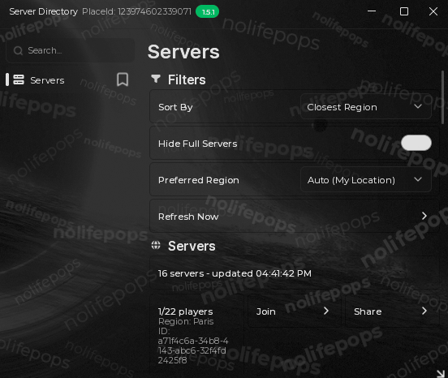

# Server Directory

Roblox's server list shows you a "ping" number for each server. It's almost always wrong, usually just 0. This is a server browser that fixes that.

## ⚠️ What this plugin loads and calls out to

**This plugin uses a loadstring.** It loads the [Fluent (modded)](https://github.com/LostMorality/Fluent-modded) UI library, and only that, from:

```
https://github.com/LostMorality/Fluent-modded/releases/download/Fluent/FluentPro
```

**This plugin makes HTTP requests to servers other than roblox.com:**

- **`apis.rovalra.com`** ([RoValra](https://github.com/NotValra/RoValra)'s public API): to get the list of Roblox datacenters and figure out which datacenter each server is running in.
- **`ipapi.co`**: to get your rough physical location from your IP address, so the plugin can tell which servers are actually close to you. This sends your IP address to that service.



## What it does

It shows you real player counts, straight from Roblox. It figures out roughly where you are and ranks servers by how close they actually are to you. It also gives you a ping guess for each one, tuned using your real connection instead of a made-up number.

The server you're currently in always sits at the top of the list, with its button reading Rejoin instead of Join, so you can see at a glance which one you're on and grab a link to it.

You can sort by fewest players, most players, or closest server, and hide full servers if you want. Hit Join to jump into a server, or Share to copy a script that joins it later. If something fails, it quietly retries instead of breaking, and it cleans itself up if you close the window.

## How it works

It grabs a list of every Roblox datacenter in the world. That data comes from [RoValra](https://github.com/NotValra/RoValra), who maintain it.

Then it figures out roughly where you are using your IP address, and measures the real distance from you to each datacenter.

It also checks your actual ping to whatever server you're already on. That real number is used to make its guesses about the other servers much more accurate, instead of just assuming everyone's internet works the same.

Finally, it pulls live player counts from Roblox and lines them up with the region info. You end up with one list: sorted by what's actually close to you, showing real player counts, with a ping guess that's actually based on something.

## Installing it

This is a plugin for Infinite Yield, so you don't run a loadstring yourself to install it (the plugin has its own loadstring inside it, see the warning above). You add it the same way you'd add any other IY plugin:

1. [Download `ServerDirectory.iy`](ServerDirectory.iy).
2. Put it in your executor's `workspace` folder.
3. In-game, open Infinite Yield, go to Settings, then Plugins, then Add Plugin, and type `ServerDirectory.iy`.
4. Open Infinite Yield's cmd box and type `sd` to open it.

## What you need

An executor that can make HTTP requests, [Fluent (modded)](https://github.com/LostMorality/Fluent-modded) (it loads on its own, you don't need to do anything), and [Infinite Yield](https://github.com/EdgeIY/infiniteyield).

## Thanks

This wouldn't exist without [RoValra](https://github.com/NotValra/RoValra), who maintain the datacenter and server data this whole thing runs on. Thanks also to [Fluent (modded)](https://github.com/LostMorality/Fluent-modded) for the UI.

## License

GPL-3.0. See [LICENSE](LICENSE).
